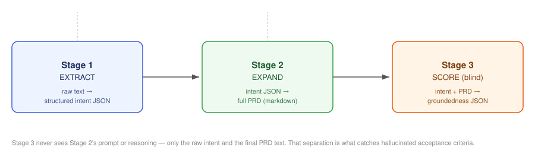

# prd-chain


A three-stage LLM prompt chain that turns a raw, messy idea into a
scored, production-ready PRD — and catches hallucinated acceptance
criteria before they reach an engineering team.



## The problem

Ask a single LLM call to "write a PRD and check your own work" and it
will confidently agree with itself. The failure mode in production PM
work isn't a badly-written PRD — it's a well-written PRD with an
acceptance criterion that sounds plausible but was never actually in
the original request. That's the kind of thing that ships a feature
nobody asked for.

## The pattern

1. **EXTRACT** — a raw input (Slack message, meeting notes, a rambling
   feature request) is compressed into a structured intent JSON. This
   JSON becomes the single source of truth for everything downstream.
2. **EXPAND** — the intent JSON (not the raw text) is expanded into a
   full PRD: goals, non-goals, user stories, acceptance criteria,
   success metrics, open risks.
3. **SCORE** — an independent pass, with no visibility into Stage 2's
   prompt or reasoning, checks the final PRD against the original
   intent and flags any acceptance criterion it can't trace back to
   the source.

The separation between Stage 2 and Stage 3 is the actual point of this
repo. A model grading its own output tends to rubber-stamp it; a model
that only sees the final artifact and the original ask has no reason
to be lenient.

## Run it

```bash
git clone https://github.com/amruth-charmana/prd-chain.git
cd prd-chain
pip install -r requirements.txt
cp .env.example .env   # add your ANTHROPIC_API_KEY
export $(cat .env | xargs)

python -m src.prd_chain --input examples/sample_input.txt --output out.md
```

See [`examples/sample_output.md`](examples/sample_output.md) for what
the output looks like without running it yourself — note that file is
a hand-written illustration, not a captured run; run the chain
yourself for a real one.

### Run the tests

```bash
pip install pytest
pytest tests/ -v
```

The test suite covers `_parse_json_block` (the recovery logic for when
the model doesn't return clean JSON) without requiring an API key —
CI runs this on every push.

## What this demonstrates

- Multi-stage prompt chaining with a strict single-source-of-truth
  handoff between stages (Stage 2 only ever sees Stage 1's JSON, never
  the raw input)
- An independent, blind scoring pass as a hallucination check —
  the same architectural pattern used across the other repos in
  [ai-pm-toolkit](../)
- Structured JSON extraction with explicit "don't invent detail"
  constraints in the system prompt

## Production-hardening decisions

- **Retries with backoff** on rate limits, connection errors, and 5xx
  responses — not on 4xx, since a bad request is a prompt bug, not a
  transient failure worth retrying.
- **JSON self-correction**: if a stage's output doesn't parse, the
  chain retries once with a stricter instruction appended, instead of
  failing the whole run over a formatting slip.
- **No temperature/top_p/top_k overrides.** Claude Sonnet 5 runs
  adaptive thinking by default and rejects non-default sampling
  params with a 400 — this is a deliberate choice, not an omission.

## Notes

See [`LEARNINGS.md`](LEARNINGS.md) for what broke while building this
and what I'd change next time.
